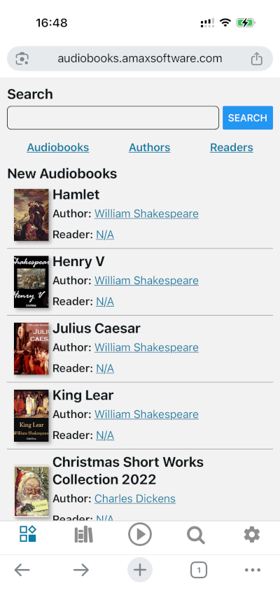
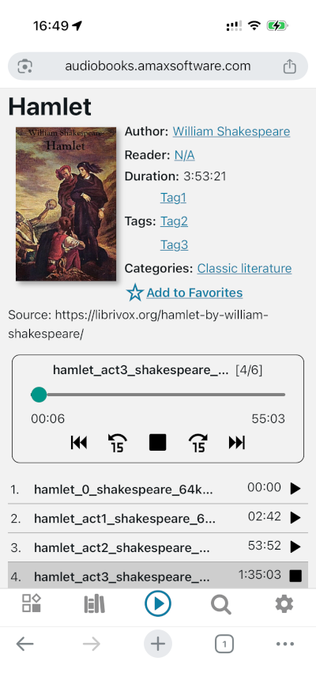

# Audio Player

Check out the demo here: https://audiobooks.amaxsoftware.com

 

This project is currently in an early development stage.

It is intended to serve as a universal platform for distributing public-domain audiobooks, featuring both a dedicated server solution and a mobile client for the web, Android, and iOS.

The server is built with Node.js and uses MySQL/MariaDB as its database layer.

The client is a React Native application developed with Expo and includes multilingual support.

The server architecture will support simple single-machine deployments while also being scalable to more advanced setups with dedicated workers/nodes for the web client, API server, Redis cache, database clusters, and network file storage or file clusters.

[Installation Guide](./docs/installation/README.md)

#### Project Structure
* apps/audiobook-player-rn-app – React Native Audiobook Player (client).
* apps/audiobook-player-server – Node.js backend server (server).
* audiobook-files/ – Local storage directory for audiobook media files.
* docs/ – Project documentation.
* import/ – Directory for audiobooks/assets prepared for import.
* packages/shared – Package with shared data types used by both the server and client.
* secrets/ – Private keys, secrets, configuration files, and provisioning profiles.
* tools/build-export – Utility for building/exporting archives containing the server, client, media files, and database for quick deployment on a server.
* tools/build-import – Utility for importing exported builds.
* tools/ffmpeg – FFmpeg executables used during audiobook processing and import.
